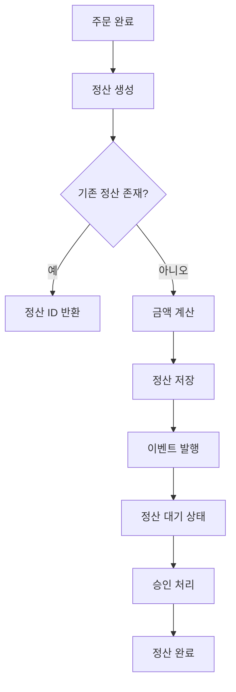

# 정산 시스템 가이드

## 개요

정산 시스템은 운송 서비스의 금전 거래를 관리하는 핵심 모듈입니다. 주문 완료 후 차주(기사)와 화주 간의 금액 정산을 자동화하고, 플랫폼 수수료를 계산합니다.

## 주요 컴포넌트

### 1. SettlementService
정산 데이터의 생성, 조회, 상태 변경을 담당하는 핵심 서비스입니다.

**주요 기능:**
- `createSettlement()`: 주문 완료 시 정산 데이터 생성
- `updateStatus()`: 정산 상태 변경 (대기 → 승인 → 완료)
- `approve()`: 정산 승인 처리
- `findSettlementsByPeriod()`: 기간별 정산 조회

**관계:**
- PaymentRepository를 사용하여 데이터 저장/조회
- SettlementCalculator를 호출하여 금액 계산
- SettlementEventPublisher를 통해 이벤트 발행

### 2. PaymentRepository
정산 데이터의 영속성 계층을 담당하는 저장소입니다.

**주요 기능:**
- `findByOrderId()`: 주문 ID로 정산 조회
- `findByDriverId()`: 차주별 정산 목록 조회
- `findByShipperId()`: 화주별 정산 목록 조회
- `findPendingSettlements()`: 대기 중인 정산 조회
- `findApprovedSettlementsByPeriod()`: 승인된 정산 조회 (리포트용)

**기술 스택:**
- Spring Data R2DBC (비동기 DB 접근)
- Kotlin Coroutines

### 3. SettlementCalculator
정산 금액을 계산하는 비즈니스 로직을 담당합니다.

**주요 기능:**
- `calculate()`: 정산 금액 계산
- `recalculate()`: 정산 금액 재계산
- `aggregateMonthly()`: 월별 정산 집계

**계산 규칙:**
```
차주 지급액 = (기본 운임 + 추가 비용) - 플랫폼 수수료
화주 청구액 = (기본 운임 + 추가 비용) + 부가세
플랫폼 수수료 = (기본 운임 + 추가 비용) * 수수료율

수수료율:
- 정회원: 12%
- 준회원: 15%
- 기본: 15%
```

## 정산 프로세스



## 정산 상태 전이

```
PENDING (대기)
    ↓
    ├─→ APPROVED (승인)
    │       ↓
    │   COMPLETED (완료)
    │
    └─→ REJECTED (거부)
```

## API 사용 예제

### 정산 생성
```kotlin
val settlementId = settlementService.createSettlement(
    orderId = UUID.fromString("550e8400-e29b-41d4-a716-446655440000"),
    driverId = UUID.fromString("660e8400-e29b-41d4-a716-446655440000"),
    shipperId = UUID.fromString("770e8400-e29b-41d4-a716-446655440000"),
    baseAmount = BigDecimal("100000"),  // 기본 운임 10만원
    extraFees = BigDecimal("5000")      // 추가 비용 5천원
)
```

### 정산 승인
```kotlin
settlementService.approve(
    settlementId = settlementId,
    approvedBy = UUID.fromString("880e8400-e29b-41d4-a716-446655440000")
)
```

### 기간별 정산 조회
```kotlin
val settlements = settlementService.findSettlementsByPeriod(
    startDate = ZonedDateTime.now().minusMonths(1),
    endDate = ZonedDateTime.now(),
    status = SettlementStatus.APPROVED
)
```

## 데이터베이스 스키마

```sql
CREATE TABLE settlements (
    id UUID PRIMARY KEY,
    order_id UUID NOT NULL UNIQUE,
    driver_id UUID NOT NULL,
    shipper_id UUID NOT NULL,
    driver_amount DECIMAL(15,2) NOT NULL,
    shipper_amount DECIMAL(15,2) NOT NULL,
    platform_fee DECIMAL(15,2) NOT NULL,
    status VARCHAR(20) NOT NULL,
    approved_by UUID,
    approved_at TIMESTAMP WITH TIME ZONE,
    created_at TIMESTAMP WITH TIME ZONE NOT NULL,
    updated_at TIMESTAMP WITH TIME ZONE NOT NULL,
    INDEX idx_order_id (order_id),
    INDEX idx_driver_id (driver_id),
    INDEX idx_shipper_id (shipper_id),
    INDEX idx_status (status)
);
```

## 이벤트 처리

정산 시스템은 다음 이벤트를 발행합니다:

1. **SettlementCreated**: 정산 생성 시
2. **SettlementStatusChanged**: 상태 변경 시
3. **SettlementApproved**: 승인 시

이벤트는 Kafka를 통해 다른 마이크로서비스로 전파됩니다.

## 에러 처리

### SettlementNotFoundException
- 정산 데이터를 찾을 수 없을 때 발생
- HTTP 404로 매핑

### IllegalStateTransitionException
- 유효하지 않은 상태 전이 시도 시 발생
- HTTP 400으로 매핑

## 모니터링

### 주요 메트릭
- `settlement.created.count`: 생성된 정산 개수
- `settlement.approved.count`: 승인된 정산 개수
- `settlement.amount.sum`: 정산 금액 합계
- `settlement.processing.time`: 정산 처리 시간

### 로그 레벨
- `INFO`: 정산 생성, 승인 등 주요 이벤트
- `DEBUG`: 계산 상세 내용
- `WARN`: 중복 생성 시도 등 경고

## 참고 사항

1. 모든 금액은 `BigDecimal`을 사용하여 정확한 계산을 보장합니다.
2. 정산 데이터는 불변성을 유지하며, 수정 시 새 레코드를 생성합니다.
3. 비동기 처리를 위해 Kotlin Coroutines를 사용합니다.
4. 트랜잭션 일관성을 위해 `@Transactional` 어노테이션을 사용합니다.

## 관련 문서

- [결제 API 가이드](../../payment/docs/payment_guide.md)
- [주문 시스템 가이드](../../order/docs/order_guide.md)
- [기사 관리 가이드](../../driver/docs/driver_guide.md)
