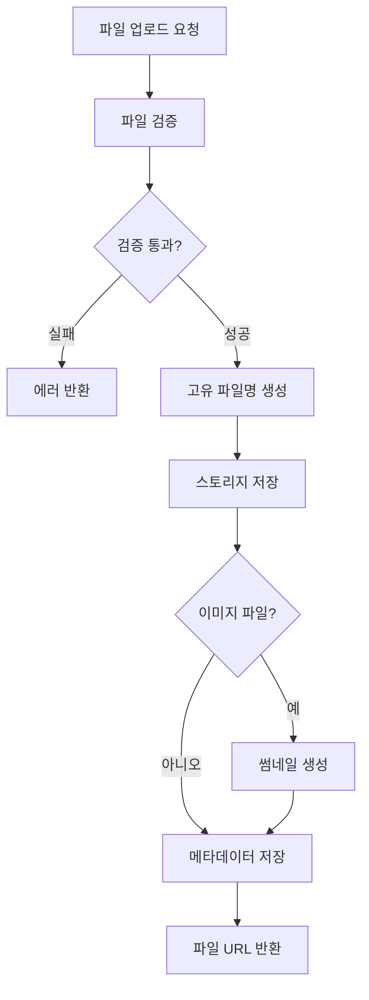

# 파일 API 가이드

## 개요

파일 API는 애플리케이션의 모든 파일 업로드, 다운로드, 관리를 담당하는 핵심 서비스입니다. 주문서, 인수증, 프로필 이미지, 차량 사진 등 다양한 파일을 안전하게 저장하고 관리합니다.

## 주요 컴포넌트

### 1. FileService
파일의 업로드, 조회, 삭제를 담당하는 핵심 서비스입니다.

**주요 기능:**
- `uploadFile()`: 파일 업로드 및 메타데이터 저장
- `getFileInfo()`: 파일 정보 조회 (권한 검증 포함)
- `deleteFile()`: 파일 논리 삭제
- `findFilesByCategory()`: 카테고리별 파일 조회
- `findFilesByRelatedEntity()`: 연관 엔티티의 파일 조회
- `cleanupTemporaryFiles()`: 임시 파일 정리

**관계:**
- FileRepository를 사용하여 메타데이터 저장/조회
- FileStorageProvider를 호출하여 실제 파일 저장 (S3, Local 등)
- FileValidator를 사용하여 파일 검증
- ThumbnailGenerator를 사용하여 이미지 썸네일 생성

### 2. FileRepository
파일 메타데이터의 영속성 계층을 담당하는 저장소입니다.

**주요 기능:**
- `findByStoredFileName()`: 저장된 파일명으로 조회
- `findByCategory()`: 카테고리별 파일 조회
- `findByUploaderId()`: 업로더별 파일 조회
- `findByRelatedEntityId()`: 연관 엔티티의 파일 조회
- `findTemporaryFiles()`: 임시 파일 조회 (정리 대상)
- `findByFileSizeRange()`: 파일 크기 범위로 조회

**기술 스택:**
- Spring Data MongoDB (유연한 스키마)
- Kotlin Coroutines
- GridFS (대용량 파일 지원)

## 지원 파일 타입

| 카테고리 | 확장자 | 최대 크기 | 용도 |
|---------|--------|----------|------|
| 이미지 | jpg, jpeg, png, gif | 10MB | 프로필, 차량, 상품 이미지 |
| 문서 | pdf, docx, xlsx | 50MB | 주문서, 계약서, 보고서 |
| 데이터 | csv | 50MB | 대량 데이터 import/export |
| 압축 | zip | 100MB | 여러 파일 묶음 전송 |

## 파일 카테고리

```kotlin
enum class FileCategory {
    ORDER_DOCUMENT,     // 주문서
    DELIVERY_RECEIPT,   // 인수증
    INVOICE,            // 계산서
    PROFILE_IMAGE,      // 프로필 이미지
    VEHICLE_IMAGE,      // 차량 이미지
    LICENSE,            // 면허증
    REGISTRATION,       // 등록증
    OTHER               // 기타
}
```

## 파일 업로드 프로세스



## API 사용 예제

### 1. 파일 업로드
```kotlin
val file: MultipartFile = // ... 업로드된 파일
val uploaderId = UUID.fromString("550e8400-e29b-41d4-a716-446655440000")
val orderId = UUID.fromString("660e8400-e29b-41d4-a716-446655440000")

val fileInfo = fileService.uploadFile(
    file = file,
    uploaderId = uploaderId,
    category = FileCategory.ORDER_DOCUMENT,
    relatedEntityId = orderId
)

println("파일 업로드 완료: ${fileInfo.storageUrl}")
```

### 2. 파일 정보 조회
```kotlin
val fileId = UUID.fromString("770e8400-e29b-41d4-a716-446655440000")
val requesterId = UUID.fromString("550e8400-e29b-41d4-a716-446655440000")

val fileInfo = fileService.getFileInfo(
    fileId = fileId,
    requesterId = requesterId
)

println("파일명: ${fileInfo.originalFileName}")
println("크기: ${fileInfo.fileSize} bytes")
println("URL: ${fileInfo.storageUrl}")
```

### 3. 파일 삭제
```kotlin
val fileId = UUID.fromString("770e8400-e29b-41d4-a716-446655440000")
val deleterId = UUID.fromString("550e8400-e29b-41d4-a716-446655440000")

fileService.deleteFile(
    fileId = fileId,
    deleterId = deleterId
)

println("파일 삭제 완료")
```

### 4. 카테고리별 파일 조회
```kotlin
val files = fileService.findFilesByCategory(
    category = FileCategory.DELIVERY_RECEIPT,
    uploaderId = uploaderId  // 선택적
)

files.forEach { file ->
    println("${file.originalFileName} - ${file.createdAt}")
}
```

### 5. 연관 엔티티의 파일 조회
```kotlin
val orderId = UUID.fromString("660e8400-e29b-41d4-a716-446655440000")

val orderFiles = fileService.findFilesByRelatedEntity(
    relatedEntityId = orderId
)

println("주문 관련 파일: ${orderFiles.size}개")
```

## REST API 엔드포인트

### POST /api/v1/files/upload
파일을 업로드합니다.

**Request:**
```http
POST /api/v1/files/upload
Content-Type: multipart/form-data

file: [binary data]
category: ORDER_DOCUMENT
relatedEntityId: 660e8400-e29b-41d4-a716-446655440000
```

**Response:**
```json
{
  "id": "770e8400-e29b-41d4-a716-446655440000",
  "originalFileName": "order_001.pdf",
  "fileSize": 1048576,
  "contentType": "application/pdf",
  "storageUrl": "https://storage.example.com/files/770e8400.pdf",
  "thumbnailUrl": null,
  "createdAt": "2024-03-15T10:30:00Z"
}
```

### GET /api/v1/files/{fileId}
파일 정보를 조회합니다.

**Response:**
```json
{
  "id": "770e8400-e29b-41d4-a716-446655440000",
  "originalFileName": "order_001.pdf",
  "storedFileName": "770e8400-e29b-41d4-a716-446655440000.pdf",
  "fileSize": 1048576,
  "contentType": "application/pdf",
  "extension": "pdf",
  "category": "ORDER_DOCUMENT",
  "storageUrl": "https://storage.example.com/files/770e8400.pdf",
  "status": "ACTIVE",
  "createdAt": "2024-03-15T10:30:00Z"
}
```

### DELETE /api/v1/files/{fileId}
파일을 삭제합니다. (논리 삭제)

**Response:**
```json
{
  "success": true,
  "message": "파일이 삭제되었습니다"
}
```

### GET /api/v1/files/category/{category}
카테고리별 파일 목록을 조회합니다.

**Response:**
```json
{
  "files": [
    {
      "id": "770e8400-e29b-41d4-a716-446655440000",
      "originalFileName": "order_001.pdf",
      "fileSize": 1048576,
      "createdAt": "2024-03-15T10:30:00Z"
    }
  ],
  "total": 1
}
```

## 파일 검증 규칙

### 1. 파일 크기 검증
```kotlin
when {
    isImageFile(extension) && fileSize > MAX_IMAGE_SIZE ->
        throw InvalidFileException("이미지 파일은 10MB를 초과할 수 없습니다")
    isDocumentFile(extension) && fileSize > MAX_DOCUMENT_SIZE ->
        throw InvalidFileException("문서 파일은 50MB를 초과할 수 없습니다")
    isArchiveFile(extension) && fileSize > MAX_ARCHIVE_SIZE ->
        throw InvalidFileException("압축 파일은 100MB를 초과할 수 없습니다")
}
```

### 2. 파일 확장자 검증
```kotlin
val allowedExtensions = ALLOWED_IMAGE_EXTENSIONS +
                       ALLOWED_DOCUMENT_EXTENSIONS +
                       ALLOWED_ARCHIVE_EXTENSIONS

if (extension !in allowedExtensions) {
    throw InvalidFileException("지원하지 않는 파일 형식입니다: $extension")
}
```

### 3. 파일 내용 검증
```kotlin
// MIME 타입 검증
val detectedMimeType = detectMimeType(file.bytes)
if (detectedMimeType != file.contentType) {
    throw InvalidFileException("파일 형식이 일치하지 않습니다")
}

// 악성 파일 검증
if (isMaliciousFile(file.bytes)) {
    throw InvalidFileException("악성 파일이 감지되었습니다")
}
```

## 접근 권한

### 파일 조회 권한
- 업로더 본인
- 연관 엔티티의 소유자
- 시스템 관리자

### 파일 삭제 권한
- 업로더 본인
- 시스템 관리자

## 데이터베이스 스키마 (MongoDB)

```javascript
{
  _id: UUID,
  originalFileName: String,
  storedFileName: String,
  fileSize: Long,
  contentType: String,
  extension: String,
  category: String,  // FileCategory enum
  storageUrl: String,
  thumbnailUrl: String?,
  uploaderId: UUID,
  relatedEntityId: UUID?,
  status: String,    // FileStatus enum
  createdAt: ISODate,
  updatedAt: ISODate,
  deletedAt: ISODate?,
  deletedBy: UUID?
}

// 인덱스
db.files.createIndex({ "storedFileName": 1 }, { unique: true })
db.files.createIndex({ "uploaderId": 1, "status": 1 })
db.files.createIndex({ "category": 1, "status": 1 })
db.files.createIndex({ "relatedEntityId": 1, "status": 1 })
db.files.createIndex({ "createdAt": -1 })
db.files.createIndex({ "status": 1, "createdAt": 1 })  // 임시 파일 정리용
```

## 스토리지 백엔드

### AWS S3 (Production)
```kotlin
class S3FileStorageProvider : FileStorageProvider {
    override suspend fun store(
        file: MultipartFile,
        storedFileName: String,
        category: FileCategory
    ): String {
        val bucket = "appius-files"
        val key = "${category.name.lowercase()}/$storedFileName"

        s3Client.putObject(bucket, key, file.inputStream, file.size)

        return "https://$bucket.s3.amazonaws.com/$key"
    }
}
```

### Local Storage (Development)
```kotlin
class LocalFileStorageProvider : FileStorageProvider {
    override suspend fun store(
        file: MultipartFile,
        storedFileName: String,
        category: FileCategory
    ): String {
        val baseDir = "/var/appius/files"
        val categoryDir = File(baseDir, category.name.lowercase())
        categoryDir.mkdirs()

        val targetFile = File(categoryDir, storedFileName)
        file.transferTo(targetFile)

        return "file://${targetFile.absolutePath}"
    }
}
```

## 임시 파일 정리

임시 파일은 스케줄러를 통해 주기적으로 정리됩니다.

```kotlin
@Scheduled(cron = "0 0 2 * * *")  // 매일 새벽 2시
suspend fun scheduleTemporaryFileCleanup() {
    val olderThan = ZonedDateTime.now().minusDays(7)  // 7일 이상 된 임시 파일
    fileService.cleanupTemporaryFiles(olderThan)
}
```

## 에러 처리

### FileNotFoundException
- 파일을 찾을 수 없을 때 발생
- HTTP 404로 매핑

### FileAccessDeniedException
- 파일 접근 권한이 없을 때 발생
- HTTP 403으로 매핑

### InvalidFileException
- 유효하지 않은 파일일 때 발생
- HTTP 400으로 매핑

## 모니터링

### 주요 메트릭
- `file.upload.count`: 업로드된 파일 개수
- `file.upload.size.sum`: 업로드된 파일 크기 합계
- `file.upload.duration`: 파일 업로드 처리 시간
- `file.storage.usage`: 스토리지 사용량

### 로그 레벨
- `INFO`: 파일 업로드, 삭제 등 주요 이벤트
- `DEBUG`: 파일 조회, 검증 상세 내용
- `ERROR`: 스토리지 오류, 검증 실패

## 참고 사항

1. 모든 파일은 고유한 UUID 기반 파일명으로 저장됩니다.
2. 이미지 파일은 자동으로 썸네일이 생성됩니다 (200x200).
3. 파일 삭제는 논리 삭제로 처리되며, 실제 삭제는 배치 작업으로 수행됩니다.
4. 대용량 파일 업로드 시 멀티파트 업로드를 권장합니다.
5. CDN을 통한 파일 제공으로 성능을 최적화합니다.

## 관련 문서

- [AWS S3 통합 가이드](../../docs/aws_s3_integration.md)
- [이미지 처리 가이드](../../docs/image_processing.md)
- [보안 가이드](../../docs/security_guide.md)
